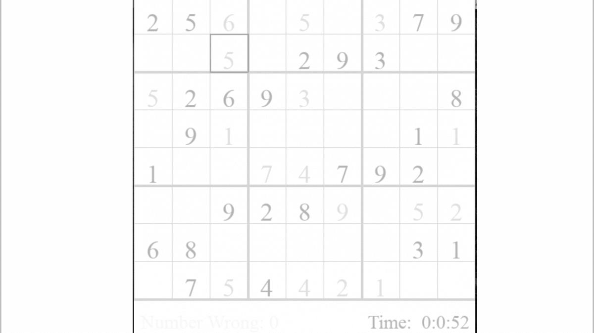

[![Contributors][contributors-shield]][contributors-url]
[![Forks][forks-shield]][forks-url]
[![Stargazers][stars-shield]][stars-url]
[![Issues][issues-shield]][issues-url]
[![MIT License][license-shield]][license-url]
[![LinkedIn][linkedin-shield]][linkedin-url]

<!-- TABLE OF CONTENTS -->
<details open="open">
  <summary>Table of Contents</summary>
  <ol>
    <li>
      <a href="#about-the-project">About The Project</a>
      <ul>
        <li><a href="#built-with">Built With</a></li>
      </ul>
    </li>
    <li>
      <a href="#getting-started">Getting Started</a>
      <ul>
        <li><a href="#prerequisites">Prerequisites</a></li>
        <li><a href="#installation">Installation</a></li>
      </ul>
    </li>
    <li><a href="#usage">Usage</a></li>
    <li><a href="#roadmap">Roadmap</a></li>
    <li><a href="#contributing">Contributing</a></li>
    <li><a href="#license">License</a></li>
    <li><a href="#contact">Contact</a></li>
    <li><a href="#acknowledgements">Acknowledgements</a></li>
  </ol>
</details>


<!-- ABOUT THE PROJECT -->
## About The Project
<p align="center">
  
</p>
An interactive Sudoku GUI with built-in Python solver
* Playable Sudoku game GUI
* Sudoku board solver to visualize backtracking algorithm
* Features timer and incorrect move counter

### Built With
* [Python](https://www.python.org/)
* [PyGame](https://www.pygame.org/)


## Getting Started
### Prerequisites
* Python
  ```sh
  https://www.python.org/downloads/
  ```

### Installation
1. Clone the repo
   ```sh
   git clone https://github.com/rexliu3/Sudoku-Solver.git
   ```


<!-- USAGE EXAMPLES -->
## Usage
1. (Optional) Change the colors in ```MainGUI.py```
   ```py
   backgroundColor = (ENTER DECIMAL CODE HERE)
   selectedBorderColor = (ENTER DECIMAL CODE HERE)
   sketchedNumberColor = (ENTER DECIMAL CODE HERE)
   numberColor = (ENTER DECIMAL CODE HERE)
   mainLinesColor = (ENTER DECIMAL CODE HERE)
   timeColor = (ENTER DECIMAL CODE HERE)
   wrongCounterColor = (ENTER DECIMAL CODE HERE)
   ```
2. Enter your custom Sudoku Board in ```MainGUI.py```
   ```py
   pre_board = [
        ["ENTER ROW 1 HERE AS STRING OF 9 NUMBERS"],
        ["ENTER ROW 2 HERE AS STRING OF 9 NUMBERS"],
        ["ENTER ROW 3 HERE AS STRING OF 9 NUMBERS"],
        ["ENTER ROW 4 HERE AS STRING OF 9 NUMBERS"],
        ["ENTER ROW 5 HERE AS STRING OF 9 NUMBERS"],
        ["ENTER ROW 6 HERE AS STRING OF 9 NUMBERS"],
        ["ENTER ROW 7 HERE AS STRING OF 9 NUMBERS"],
        ["ENTER ROW 8 HERE AS STRING OF 9 NUMBERS"],
        ["ENTER ROW 9 HERE AS STRING OF 9 NUMBERS"],
    ]
    ```
3. Run `MainGUI.py`: ``` python3 MainGUI.py ```
* This will display a Sudoku Board GUI
* Use the mouse to click and select different boxes on the board
* Use the 1 - 9 number keys to enter a number in any unfilled box
  * This will enter the number as a "guess"
  * To confirm this number, select the box and press "return"/"enter"
    * If incorrect, this will show up as an wrong X
    * If correct, the number will fill the box and be confirmed
* Press "delete" to clear the board
* Press "space" to auto-solve the board with a back-tracking algorithm


<!-- ROADMAP -->
## Roadmap
See the [open issues](https://github.com/rexliu3/Sudoku-Solver/issues) for a list of proposed features (and known issues).


<!-- CONTRIBUTING -->
## Contributing
Contributions are what make the open source community such an amazing place to be learn, inspire, and create. Any contributions you make are **greatly appreciated**.

1. Fork the Project
2. Create your Feature Branch (`git checkout -b feature/AmazingFeature`)
3. Commit your Changes (`git commit -m 'Add some AmazingFeature'`)
4. Push to the Branch (`git push origin feature/AmazingFeature`)
5. Open a Pull Request


<!-- LICENSE -->
## License
Distributed under the MIT License. See `LICENSE` for more information.


<!-- CONTACT -->
## Contact
Rex Liu - rexliu3@berkeley.edu

Project Link: [https://github.com/rexliu3/Sudoku-Solver](https://github.com/rexliu3/Sudoku-Solver)

## Acknowledgements
Built with reference to [video](https://www.youtube.com/watch?v=eqUwSA0xI-s)


[contributors-shield]: https://img.shields.io/github/contributors/rexliu3/Sudoku-Solver?style=for-the-badge
[contributors-url]: https://github.com/rexliu3/Sudoku-Solver/graphs/contributors
[forks-shield]: https://img.shields.io/github/forks/rexliu3/Sudoku-Solver?style=for-the-badge
[forks-url]: https://github.com/rexliu3/Sudoku-Solver/network/members
[stars-shield]: https://img.shields.io/github/stars/rexliu3/Sudoku-Solver?style=for-the-badge
[stars-url]: https://github.com/rexliu3/Sudoku-Solver/stargazers
[issues-shield]: https://img.shields.io/github/issues/rexliu3/Sudoku-Solver?style=for-the-badge
[issues-url]: https://github.com/rexliu3/Sudoku-Solver/issues
[license-shield]: https://img.shields.io/github/license/othneildrew/Best-README-Template.svg?style=for-the-badge
[license-url]: https://github.com/rexliu3/Sudoku-Solver/blob/master/LICENSE.txt
[linkedin-shield]: https://img.shields.io/badge/-LinkedIn-black.svg?style=for-the-badge&logo=linkedin&colorB=555
[linkedin-url]: https://linkedin.com/in/rexliu3 
